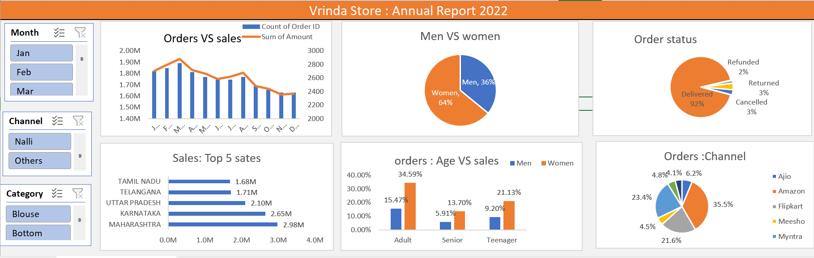

# Vrinda-store-sales-analysis

## Project Overview

This project uses Excel to analyze Vrinda Stores sales data. The goal is to understand how sales performed who the customers are, what order patterns look like and which sales channels work best.

## Tools Used

- Microsoft Excel
- Pivot Tables
- Charts and Data Visualization
- Data Analysis

## Key Analysis

- Analysis of sales and order volume
- Comparison of sales between men and women
- Analysis of order status
- Identification of the top five states by sales
- Analysis of age group and gender
- Evaluation of sales channel performance
- Generation of business insights and recommendations

## Key Insights

- March recorded the highest sales and order volume
- Women contributed more to overall sales than men
- Maharashtra, Karnataka and Uttar Pradesh were among the leading states by sales
- Amazon, Flipkart and Myntra were the leading sales channels
- Adults aged 30–49 years represented the largest customer segment, with women contributing a major share

## Business Recommendation

Focus on the strongest customer segment, particularly women aged 30–49 years. Strengthen sales through high‑performing states and channels such, as Amazon, Flipkart and Myntra.

## Dashboard Preview 

